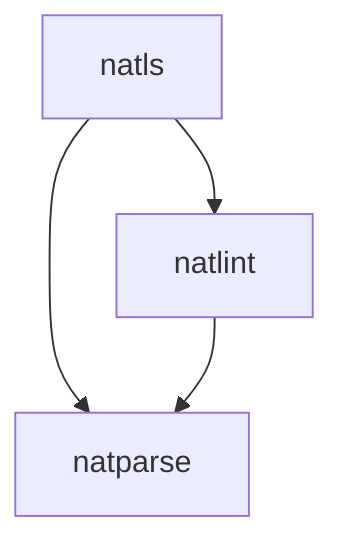

# Natural Language Server (natls)


[](https://github.com/MarkusAmshove/natlint-manual/actions/workflows/gradle-build.yml)

This repository contains a language server implementation for the [Natural language](https://en.wikipedia.org/wiki/ADABAS#Natural_(4GL)) created by Software AG.

The latest unstable build of the `main` branch can always be downloaded from the [nightly tag](https://github.com/MarkusAmshove/natls/releases/tag/unstable).

The language server supports, but isn't limited to:

- Reporting syntax and linter diagnostics as you type
- Code completion
- Hover documentation of variables and modules
- Workspace symbols
- File structure
- Quickfixes and refactorings
- Outline
- Code Snippets

A more in-depth documentation with examples of features can be found [here](docs/lsp-features.md).


## Projects



This repository contains the following projects:

- `natparse`: Parser for the Natural language and project format
- `natlint`: Static code analysis
- `natls`: Language Server implementation using `natparse` and `natlint`
- `natqube`: Plugin for SonarQube which uses `natlint` to aggregate diagnostics and measures
- `natdoc` (planned): Javadoc-like documentation format to generate a static documentation site

## Building

All projects are written in Java and require the latest JDK to build and run. The only exception is `natqube` which requires Java 11 as SonarQube only supports running on Java 11 on the server side at the moment.

All projects are aggregated as Gradle modules into a single Gradle project.

To build the project and run tests use `./gradlew build`.

To create standalone jar files (fat jars that include all dependencies) run `./gradlew shadowJar`.

## Project state

The current state of the project is considered as early development.

The parser is still [incomplete](docs/implemented-statements.md) and has some rough edges where the Natural language is context sensitive.
It also currently uses some hard coded assumptions about the language settings that should be configurable by the `.natural` file (like thousands seperators).

Some analyzers assume a coding style that might not fit your needs. This will be [configurable](https://github.com/MarkusAmshove/natls/issues/62) in the future.

## Running natlint

Natlint ships with a CLI interface to run it within a Natural project for in a CI pipeline.

To use the jar, simply run `java -jar natlint.jar` within your Natural project root directory.

To run via docker, use `docker run -w "/workspace" -v "$PWD:/workspace" ghcr.io/markusamshove/natlint:main`.

Given no arguments, the program will analyze all Natural sources that can be found in the Natural project of the working directory. The project is identified by either a `.natural` or `_naturalBuild` file.

The following flags can be used to narrow the scope down to a single or multiple files/libraries:

```shell
$ java -jar natls.jar --help

Usage: analyze [-hV] [--ci] [-s=<minimumSeverity>] [--sink=<sinkType>]
               [-d=<diagnosticIds>]... [-f=<qualifiedNames>]... [-g=<globs>]...
               [-l=<libraries>]... [-r=<relativePaths>]...
Analyze the Natural project in the current working directory
  --ci                    Analyzer will return exit code 0, even when
                            diagnostics are found. Will also use the CSV sink
  -d, --diagnostic=<diagnosticIds>
                          Filter out every diagnostic that does not match the
                            given id. Example: --diagnostic NLP011
  -f, --file=<qualifiedNames>
                          Only analyze modules matching any of the qualified
                            module name in the form of LIBRARY.MODULENAME (e.g.
                            LIB1.SUBPROG)
  -g, --glob=<globs>      Only analyze modules that match the given glob
                            pattern.
  -h, --help              Show this help message and exit.
  -l, --library=<libraries>
                          Only analyze modules that reside in any of the given
                            libraries.
  -r, --relative=<relativePaths>
                          Only analyze modules matching any of the relative
                            paths. Path should be relative to project root.
  -s, --severity=<minimumSeverity>
                          Filter out diagnostics that are below the given
                            severity. Valid values: INFO, WARNING, ERROR
      --sink=<sinkType>   Sets the output sink where the diagnostics are
                            printed to. Defaults to STDOUT. Valid values:
                            STDOUT, NONE, CSV, CI_CSV
  -V, --version           Print version information and exit.
```

## Running natls

The language server is tested primarily with two clients:

TODO:
- `natls-vscode`
- neovim via `nvim-lspconfig`

## Running natqube

To get the output of `natlint` into SonarQube, you have to first install `natqube` as a SonarQube plugin.

To do this, simply add the `natqube.jar` that comes out of `gradlew shadowJar` into the `extensions/plugins` folder of SonarQube. An example can be found in `docker/Dockerfile.sonar`.

`natqube` currently expects to find a `diagnostics.csv` file within the scanners root working directory (e.g. the root of the repository). This file is created by running the `natlint` CLI with either `--sink=CSV` or `--ci`. Using `--ci` is recommended for build servers, because it also forces `natlint` to exit gracefully to not break pipelines when encountering diagnostics.

## Acknowledgements and dependencies

The logo was created by [Duffed](https://github.com/Duffed)

The language server uses an unmodified version of [lsp4j](https://github.com/eclipse/lsp4j).
